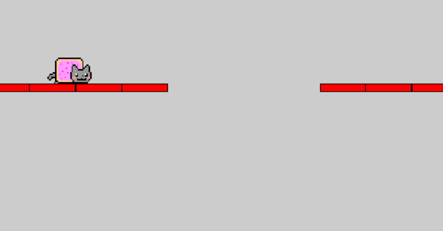
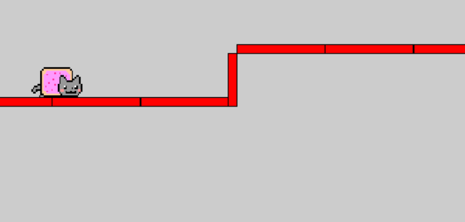

# Meme Cat Run

In this game you are collecting meme pics. You should be aim on "pair the memes" to gain most score(30). But collect a same meme can also gain you 10 score.

## Gameplay

### Control
The control is very simple and similar to some other parkour games, press **space/up/W** key to jump.

### Traps
Be careful with the landscape: try not to crash on the hill or fall into the gap.

## Special functions

### Cheat Mode
Set your name as Cheater114514 and you will enter into the cheat mode, every meme will be perfectly arranged in pair for you. In cheat mode get a high score is very easy, but you will leave you "Cheater114514" name on the leaderboard.

### Boss Key
press B (default boss key) to open outlook mail in web browser to pretend you are working.

### Settings
In setting page, you can :

* **set your player name in the setting page.**
* **customize the boss key.**
* **Enable or disable the Y-axis camera lock.**
* **Save/Load game on open/exit**

## Technical & copyright stuff:

About API using:

Although the game supports tkinter PhotoImage as well, I still highly recommend you to install PIL library to have best visual experience.

Also, try to run it On Windows to get best gameplay experience. Linux(better to run on physical machine rather than virtual machine) and Mac OS are both fine.

**But do not run on WSL**

Image resources reference:
Icons are from: https://www.pngwave.com/
meme images from: https://knowyourmeme.com/
nyan cat animation from: https://nyancat.fandom.com/es/wiki/Nyan_Cat